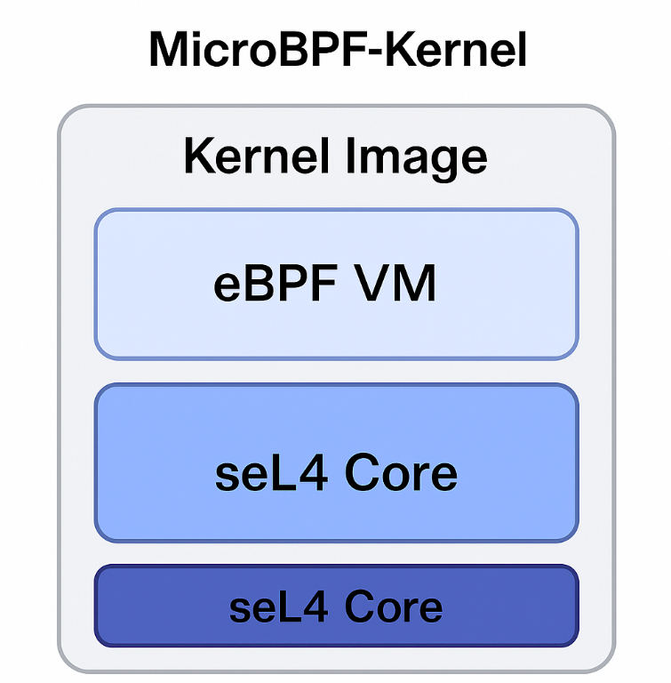

# MicroBPF-Kernel Architecture

## High-Level Diagram

## Components

### 1. seL4 Microkernel
- **Role**: Provides base isolation, scheduling, IPC.
- **Formal Guarantees**: Fully verified for functional correctness and security.

### 2. Unikernel Layer (Unikraft)
- **Role**: Links user applications directly into the kernel image.
- **Benefits**: Eliminates user/kernel boundary, reduces context-switch overhead.

### 3. eBPF VM
- **Role**: Sandbox for bytecode programs.
- **Features**: Verifier ensures safety, JIT/AOT compilation optional.
- **Interfaces**: `bpf_map`, `bpf_prog_load`, `bpf_run` syscalls.

### 4. Kernel Syscalls & IPC
- **Syscalls**: Minimal set for memory allocation, threading, and BPF operations.
- **IPC Model**: seL4 message-passing channels used for BPF map access and event notifications.

## Data Flow
1. **Boot**: QEMU or FPGA loads unikernel image.
2. **Init**: seL4 initializes, sets up BPF VM.
3. **App Startup**: `sample_app` entry calls `bpf_prog_load` to register filters.
4. **Packet Rx**: Network driver triggers BPF run, filters or transforms packets.
5. **Telemetry**: BPF program writes metrics to map, user app reads via IPC.

## Build & Run
- **Compiler**: `riscv64-unknown-elf-gcc` with `-march=rv64imac`.
- **Simulator**: `qemu-system-riscv64 -kernel microbpf.bin`
